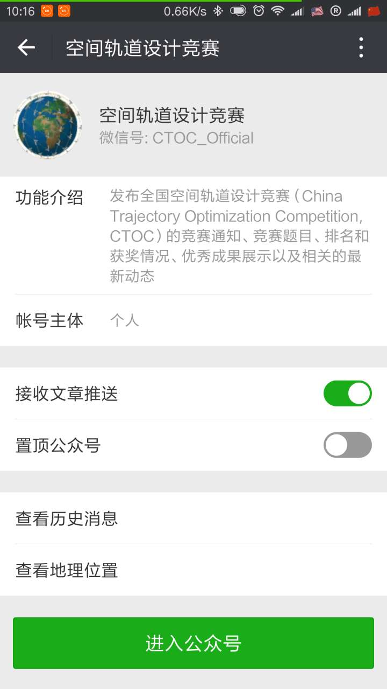

# CTOC-9（非官方页面）

数据来自 CTOC 官方公众号 **`CTOC_Official`**

---

[甲组题目：地球静止轨道卫星波束监测集群轨道设计与优化任务](CTOC9甲组题目/CTOC9甲组题目.pdf)

[甲组题目附件](CTOC9甲组题目/CTOC9甲组题目附件)

[甲组题目更正说明](CTOC9甲组题目/CTOC9甲组题目更正说明.pdf)

---

[乙组题目：地球静止轨道卫星波束监测集群轨道设计与优化任务](CTOC9乙组题目/CTOC9乙组题目.pdf)

[乙组题目附件](CTOC9乙组题目/CTOC9乙组题目附件)

[乙组题目更正说明](CTOC9乙组题目/CTOC9乙组题目更正说明.pdf)

---

[英雄榜](英雄榜.md)

---

欢迎在此处留 issue 讨论交流。

更多消息请关注官方公众号 **`CTOC_Official`**

